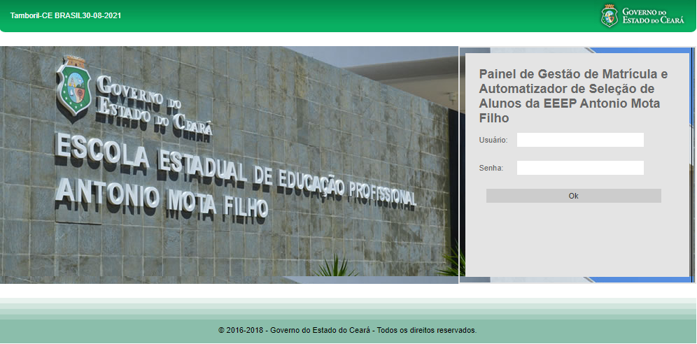
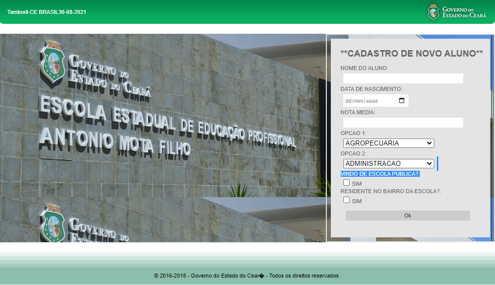
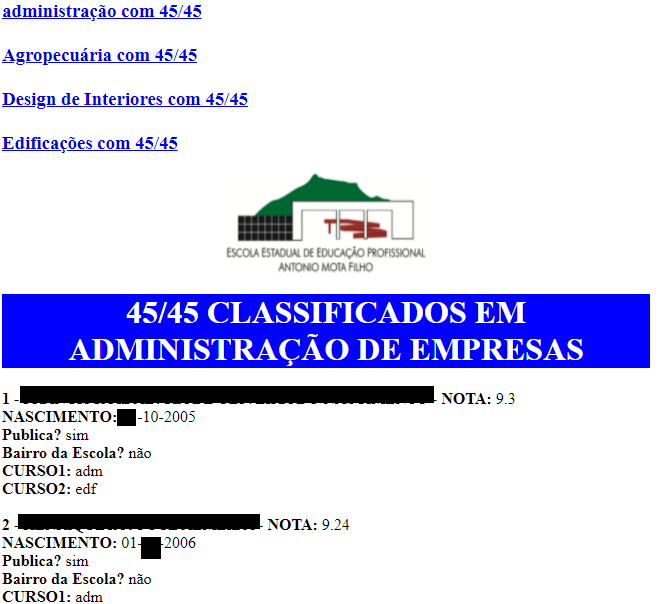
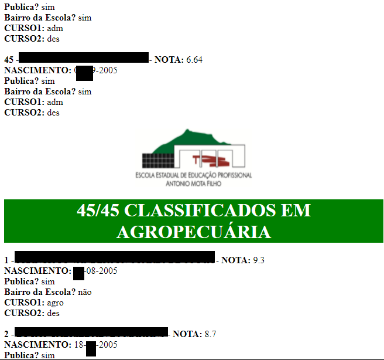

# public-Selecao-Alunos-EEEP-web-php

PROJETO WEB (Arquivos PHP/HTML/CSS):

Status: Em produção (outra versão);

Ano de publicação: 2016;

PHP: 7;

Última versão: 1.6;

Identificação: sistemadematriculas;

Link de acesso: SERVIDORTEMPORARIO/sistemadematriculas;

Descrição:

Sistema desenvolvido para automatizar o processo de decisão, ranqueamento, documentação e formatação dos dados de seleção de novos alunos.

Recursos:

Autenticação;
Cadastro de alunos;
Ranqueamento em tempo real (com possibilidade de canal aberto ao público);
Versões de Ranqueamento;
Auditável;
Versões completas, resumidas e padronizadas (para divulgação oficial);

